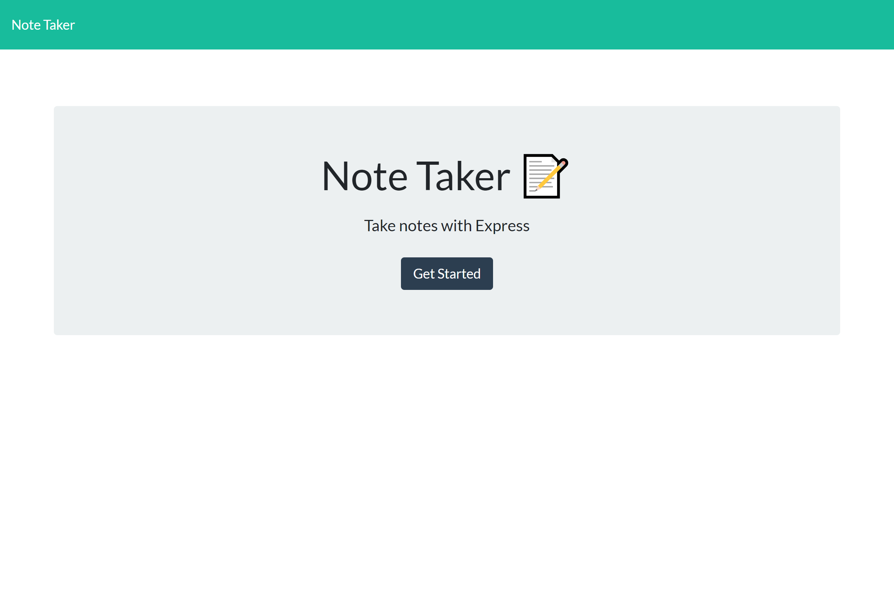
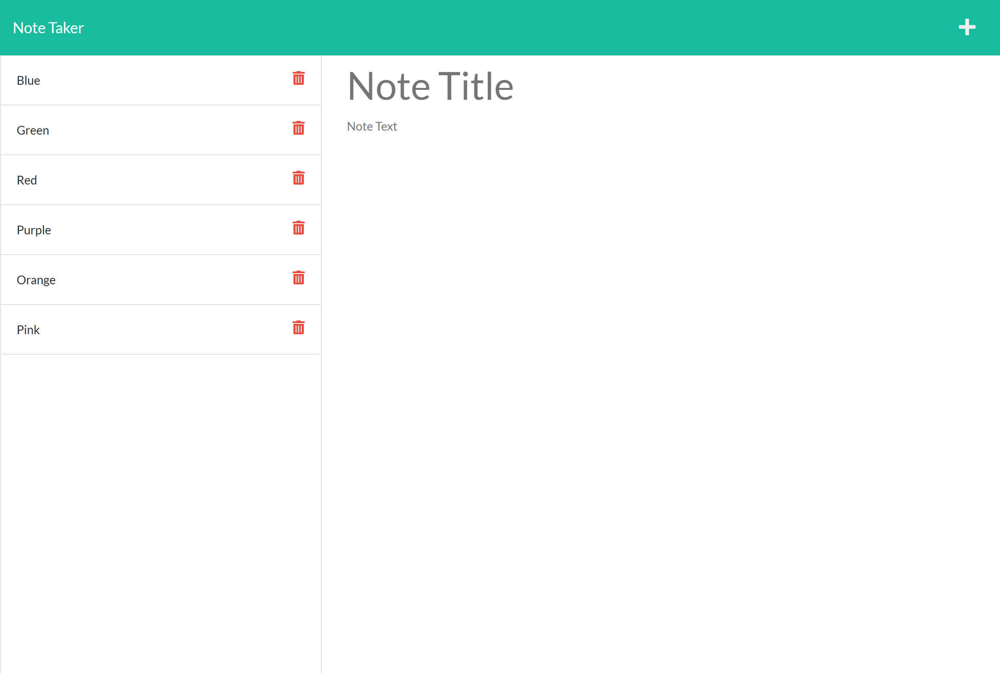

# Note Taker

 &nbsp;&nbsp;&nbsp;&nbsp; &nbsp;&nbsp;&nbsp;&nbsp; &nbsp;&nbsp;&nbsp;&nbsp;

## :memo: Description
  This web application can be used to write, save, and delete notes.


## :trophy: Table of Contents
* [Installation](#installation)
* [Usage](#usage)
* [Contributing](#contributing)
  

## Installation
To run locally:
* Fork the https://github.com/Karina5151/Note-Taker repo.
* Clone your forked repo to VS Code on your computer.
* Open entire parent folder of the project in your terminal.
* Install the node dependencies by entering in the terminal:
```
npm i
```

User must then run `node index.js` in the terminal. The application will then be listening on port 8080. Open your browser and put `localhost:8080` in the address bar of the browser page to see the application on your local device.
  
## Usage
To generate notes for the user to stay organzied and keep track of tasks or thoughts in one place. They may delete notes as well. 

Launch Heroku deployed web application [here](https://note-taker5151.herokuapp.com/)




  
## Contributing
This application was developed by Karina Clausen. 

The technologies that made this possible are:
* HTML
* CSS
* JavaScript
* <a href="https://nodejs.org/api/fs.html" target="_blank">Node.js</a>
* <a href="https://expressjs.com/" target="_blank">Express.js</a>
* <a href="https://www.npmjs.com/package/uuid" target="_blank">uuid-npm</a>
* <a href="https://www.json.org/json-en.html" target="_blank">JSON</a>
* <a href="https://shields.io/" rel="nofollow" target="_blank">Shields.io</a>
* <a href="https://getbootstrap.com/" rel="nofollow" target="_blank">Bootstrap</a>

  
  
  
  
 ---

## :question: Questions

For any questions, please contact me using the information below:

:octocat: GitHub: [@Karina5151](https://github.com/Karina5151)

:envelope: Email: karina.clausen.11@gmail.com

